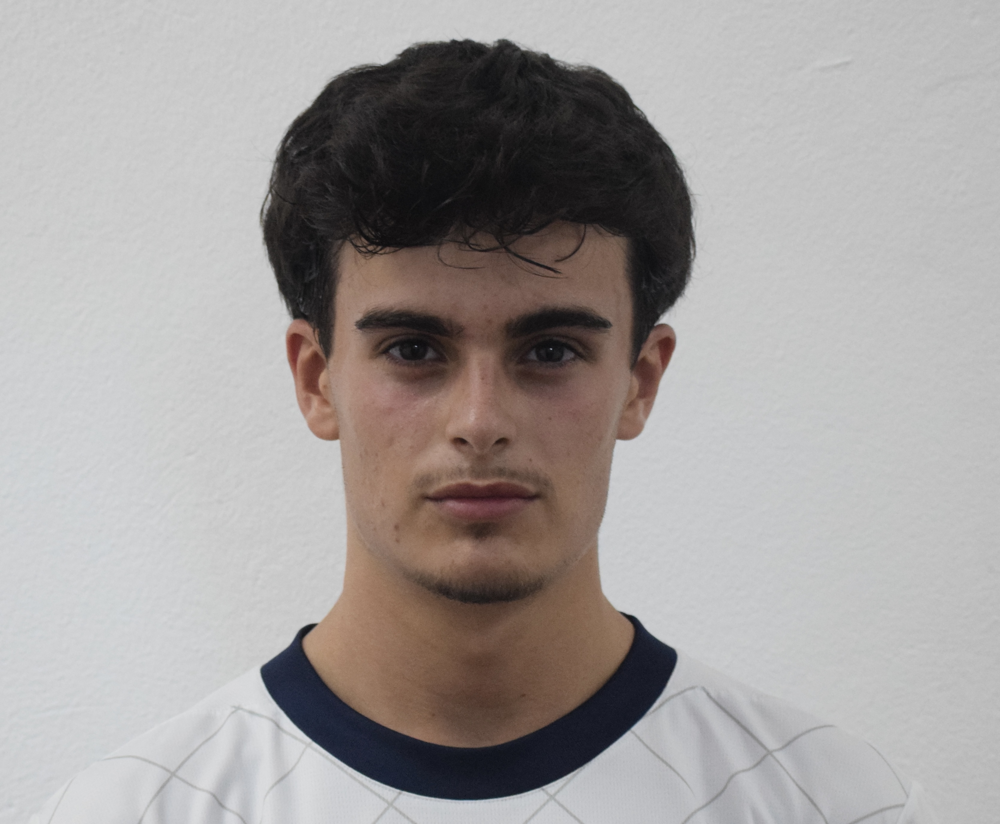
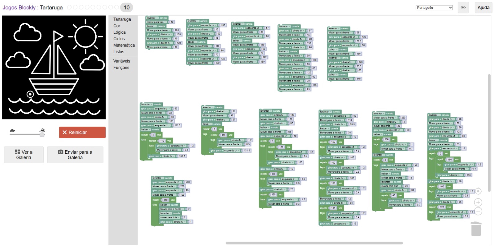

Markdown
# Manifesto do TPC1
David Carvalho Lopes
A115067

## Resumo 
O TPC1 consistiu na resolução de problemas no jogo "Blockly Games". O objetivo na primeira parte do trabalho no jogo Maze era fazer chegar a personagem ao destino através de indicaçºoes simples, completando o nível 10. Por fim realizei no jogo Turtle a imagem de um barco, pedida pelo professor.
## Lista de Resultados

